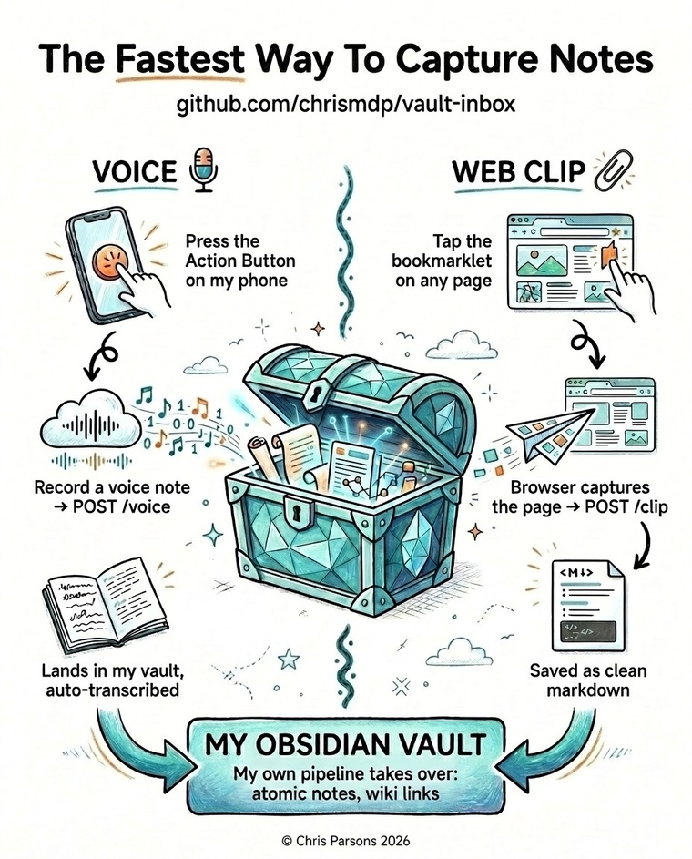

# inbox

> A tiny, private HTTP inbox for your notes vault. Drop **voice memos** and
> **web clips** in from your phone — your own pipeline takes it from there.

*Started life as `voice-inbox`; it catches web articles too now.*

<p align="center">
  
</p>

One small FastAPI service, bearer-token auth, bound to localhost. Two ways in,
both landing in your Obsidian vault:

- **Voice** — an iOS Shortcut (Action Button) POSTs a recording → saved → an
  optional transcribe hook fires.
- **Web clips** — a bookmarklet captures the *rendered* page → saved as clean
  markdown into `~/vault/links/`, where your existing capture pipeline picks it up.

It never reaches out: no third party sees your audio, and the clipper never
fetches a URL itself — the browser sends what it actually sees, so paywalled and
logged-in pages work too.

## Why

iOS doesn't give apps programmatic access to iCloud Drive, and you don't want a
SaaS sitting in the middle of your private notes. Running one tiny endpoint you
own — reachable over Tailscale or behind your own TLS — is the simplest reliable
way to get things off your phone and into your vault.

## How it works

```
VOICE  iOS Shortcut (Action Button)
  → POST /voice  → ~/vault/audio/recordings/voice-<ts>[-label].<ext>
                 → fires transcribe-voice-inbox.sh   (optional, fire-and-forget)

CLIP   bookmarklet (fetch → form-POST fallback)
  → POST /clip   → readability + markdownify → ~/vault/links/<slug>.md
                 → your pipeline scans links/, processes it, files the source
```

The service just lands the file (and, for voice, spawns a hook). Everything
downstream is your own scripts — none of your pipeline is baked in here.

## Install

Needs Python 3.11+ and [uv](https://docs.astral.sh/uv/).

```bash
git clone https://github.com/chrismdp/vault-inbox.git
cd vault-inbox
uv sync
```

The service needs one secret, `VAULT_INBOX_BEARER_TOKEN`. Simplest is a
gitignored `.env`:

```bash
python3 -c 'import secrets; print("VAULT_INBOX_BEARER_TOKEN=" + secrets.token_urlsafe(32))' > .env
```

Prefer not to keep the token on disk? Provide it however you like — it's just an
env var. To resolve it from a secrets manager at launch, wrap the start command
in e.g. 1Password's [`op run`](https://developer.1password.com/docs/cli/secret-references/)
with `VAULT_INBOX_BEARER_TOKEN=op://<vault>/<item>/password`.

Run it (binds localhost only — exposing it is the next step):

```bash
uv run uvicorn main:app --host 127.0.0.1 --port 8790
```

Optional env:

- `TROVE_CLIP_DEST` — clip destination subdir under `~/vault` (default `links`).
  Keep it `links` if your downstream pipeline scans that directory.

### Run it as a service (systemd)

Copy to `~/.config/systemd/user/vault-inbox.service`:

```ini
[Unit]
Description=vault-inbox (voice + web clips)
After=network.target

[Service]
Type=simple
WorkingDirectory=/path/to/vault-inbox
EnvironmentFile=/path/to/vault-inbox/.env
ExecStart=/usr/local/bin/uv run --no-sync uvicorn main:app --host 127.0.0.1 --port 8790
Restart=always
RestartSec=5

[Install]
WantedBy=default.target
```

`systemctl --user enable --now vault-inbox` (plus `loginctl enable-linger $USER`
so it survives logout).

## Exposing it

The service binds `127.0.0.1`, never `0.0.0.0`. Pick one way to reach it from
your phone.

### Option A — Tailscale (private; recommended)

Expose the service on your tailnet with automatic HTTPS, reachable only by *your*
devices — no public internet exposure, no nginx, no certificate to manage. Use
[Tailscale Serve](https://tailscale.com/kb/1312/serve) to proxy your tailnet name
to `localhost:8790` (see their docs for the current command).

Then load `/clip/setup` over your `https://<machine>.<tailnet>.ts.net` URL: since
the setup page derives its endpoint from whatever host you open it on, the
bookmarklet it builds targets your tailnet automatically. Clipping keeps working
as long as the Tailscale app is connected on your phone.

### Option B — nginx + public TLS

Front it with nginx (or Caddy) terminating TLS on a public hostname.
`nginx-voice.snippet.conf` has the location blocks for `/voice`,
`/voice/health`, and `/clip` (the clip block raises `client_max_body_size` for
full-page HTML). Get a cert with certbot, paste the blocks into your server
block, then `nginx -t && systemctl reload nginx`.

## Setting up the clients

### Web clipper (bookmarklet)

1. Open **`https://<your-host>/clip/setup`** in a browser.
2. Paste your token — it stays in the browser; the page builds the bookmarklet locally.
3. Tap **Copy bookmarklet**. (The code shows in a selectable box because iOS
   won't let you copy a `javascript:` link's address.)
4. **iOS Safari:** bookmark the setup page (Share → Add Bookmark), then
   Bookmarks → Edit → tap the bookmark → select the whole address, delete it,
   paste the copied code, and rename it "Clip to vault".
   **Desktop:** drag the link to your bookmarks bar instead.

Then tap the bookmark on any article. It captures the rendered page (or your
current text selection); you get a green **"Clipped ✓"** toast (fetch path) or a
"Clipped ✓" tab (form fallback), and the article lands in `~/vault/links/`.

> Re-grab the bookmarklet from `/clip/setup` whenever you switch hosts
> (public ↔ Tailscale) — the endpoint is baked into the bookmarklet.

### Voice notes (iOS Shortcut)

1. **Record Audio** — Quality: Normal, Start Recording: On Tap.
2. **Get Contents of URL** — URL `https://<your-host>/voice?label=note`,
   Method `POST`, Header `Authorization: Bearer <token>`, Request Body **File**
   = the Recorded Audio variable.
3. Bind it to the Action Button (Settings → Action Button → Shortcut).

`?label=` is sanitised server-side and appended to the filename.

## Endpoints

### `POST /clip` (and `GET /clip/setup`)

Saves a web page as markdown to `~/vault/<TROVE_CLIP_DEST>/<slug>.md`. Two
shapes, all fields optional except `url`:

- **JSON** (the bookmarklet's primary `fetch`, also extension / curl): token in a
  bearer header or a `token` body field; returns JSON. Works wherever the page's
  `connect-src` CSP allows your host.
- **form-encoded** (the bookmarklet's fallback): `token` as a field; returns an
  HTML "Clipped ✓" page in a new tab. A `<form>` POST rides the `form-action`
  CSP directive, so it works where a `fetch` is blocked.

| field | meaning |
|---|---|
| `url` | **required** — canonical article URL |
| `html` | rendered page HTML — the server extracts the article from it |
| `selection` | clip just this (html or text); marks `source: web clip (selection)` |
| `title`, `author`, `published`, `tags` | metadata overrides |
| `token` | the shared secret (or use the bearer header) |

The server **never fetches the URL itself** — by design, and to avoid an SSRF
surface. Send `html` or `selection`, or you get a 422. Same-URL re-clip
overwrites its file; a different page with the same title-slug gets the next
free `-N` suffix.

```bash
curl -X POST https://<your-host>/clip -H "Authorization: Bearer $TOKEN" \
  -H 'content-type: application/json' \
  -d '{"url":"https://example.com/article","html":"<html>…</html>"}'
```

> **CSP ceiling:** the bookmarklet tries `fetch` then a form POST, so it only
> fails on a site locking down *both* `connect-src` and `form-action` (a fully
> strict `default-src 'self'`). A browser extension is the only thing that fully
> bypasses page CSP — the desktop escape hatch.

### `POST /voice`

Raw audio body, or `multipart/form-data` with a `file` field. Header
`Authorization: Bearer <token>`; `Content-Type` picks the extension. Optional
`?label=`. Returns `{ok, path, bytes, transcribe_pid}`.

### `GET /health`

Unauthenticated liveness check → `{"ok": true}`.

## Security

- Bearer-token auth on every route except `/health` and `/clip/setup`;
  timing-safe (`hmac.compare_digest`, compared as bytes so a non-ASCII token
  can't crash the check).
- The clipper makes **no outbound requests** — no SSRF surface.
- Reflected values in HTML responses are escaped; extracted HTML has
  `<script>` / `<style>` / `<iframe>` / etc. stripped before conversion.
- Voice: filename extension allow-listed; `?label=` sanitised; the hook runs via
  `Popen` with a list argv (no shell).
- Covered by `tests/test_security.py` and `tests/test_clip.py`.

**Worth knowing — downstream tooling trusts what you save.** A clip's body is
whatever was on the page. If your pipeline feeds saved files to an LLM agent with
tools, treat that content as untrusted input (indirect prompt injection): it can
contain instructions aimed at the agent. That's a property of the pipeline, not
this endpoint — but the clipper makes it easy to ingest arbitrary pages, so fence
accordingly.

## Tests

```bash
uv run pytest
```

Covers auth (missing / wrong / malformed / non-ASCII token), the clip extraction
and house-style output, slug collision handling, the form and JSON paths,
path/label sanitisation, and multipart filename spoofing.

## Hook script

Optional, and not part of this repo. After a voice file lands, the service spawns
`~/vault/scripts/transcribe-voice-inbox.sh <path> <label>` if it exists —
transcribe, index, webhook, whatever you like. Clips don't fire a hook; they rely
on your vault's own scan of `links/`. If the script is absent, voice just
archives the recording.

## Contributing

**Issues welcome — pull requests aren't.** With so much AI-generated code around
now, reviewing PRs costs more than it saves. What genuinely helps is a clear,
thorough description of the problem or idea — what happens, when, and what you'd
expect instead — as an issue; I don't need the code, I'll do that part. (A
workflow auto-closes PRs and points back here.)

## License

MIT.
